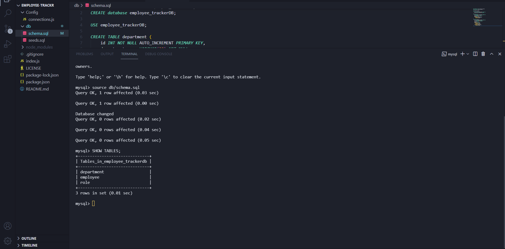
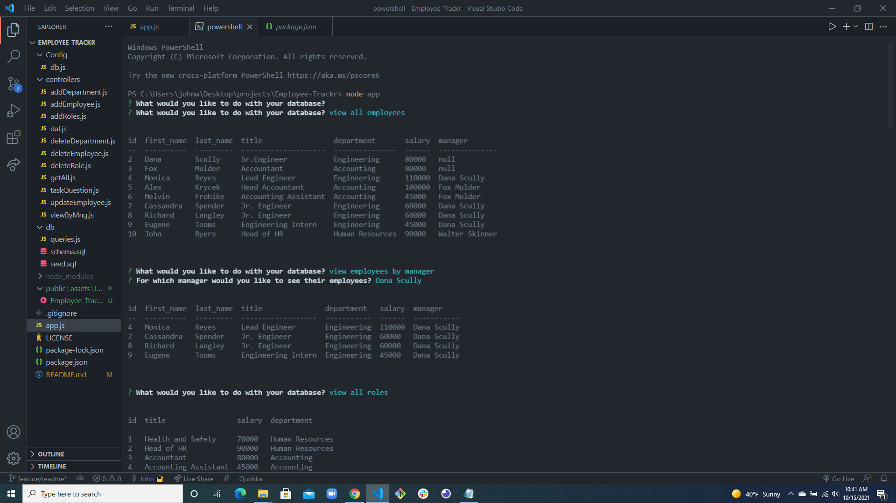
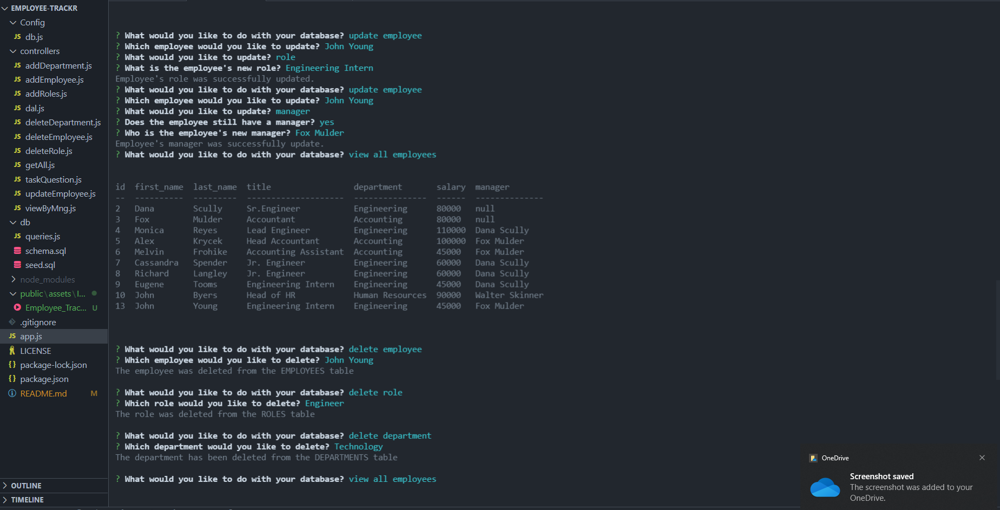
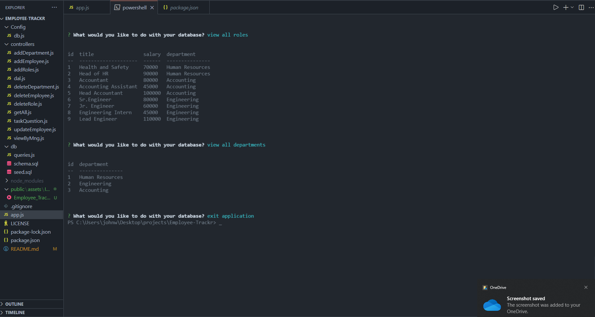
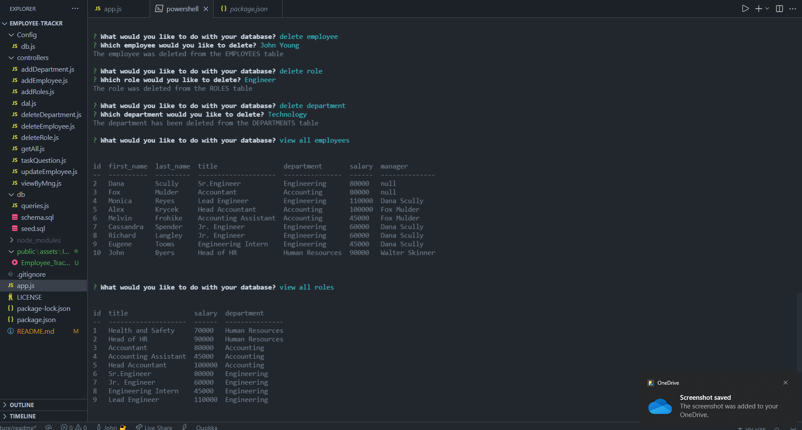

# Employee-Trackr

  

  ## Description
  A command-line application to manage a company's employee database, using Node.js, Inquirer, and MySQL.

  ## Table of Contents
  - [Installation](#Installation)
  - [Usage](#Usage)
  - [Contributing](#Contributing)
  - [Tests](#Tests)
  - [License](#License)
  - [Questions](#Questions)

  ## Installation
  * Make sure to download Nodejs and have some form of command line  
  * Then clone the repo for Employee-Trackr 
  * Once you have that, run NPM Install at the root folder of the repo to install all dependencies.  
  * Next type npm app to initiate the program * All that is left is to follow the prompts to answer the questions.

  ## Usage
  * This program is for tracking Employee information within a sql database.  
  * You can add employees 
  * Search all employees 
  * Search employee by manager 
  * Search for all roles 
  * All departments 
  * Update roles and departments for your employees
 
  
  ## Screenshots
  * 
  * 
  * 
  * 
  * 
  * 

  ## Contributing
  * 

  ## License
  This project is licensed under the terms of the following license: **MIT**.

  ## Questions
  GitHub: [jyoung0613](https://github.com/jyoung0613).  

  For inquiries, please contact jwyoung0613@gmail.com.
